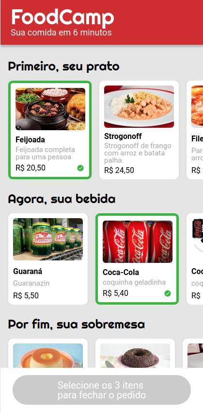
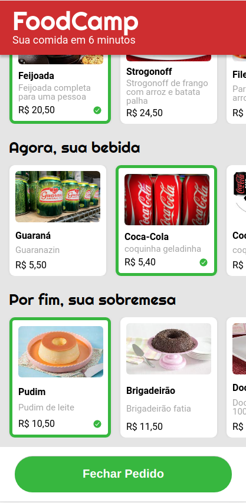
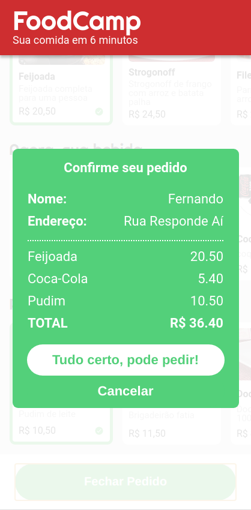
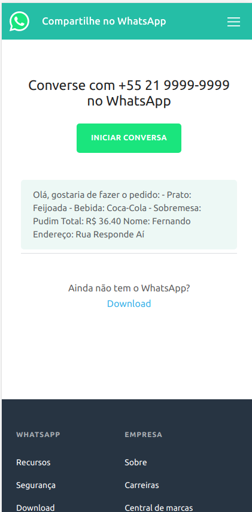

<h1 align="center">
    Projeto_FoodCamp
</h1>

 

<h4 align="center"> 
	 Status: Entregue.
</h4>

## Sobre

Terceiro projeto realizado durante o **Bootcamp Responde Aí** do [Responde Aí](https://page.respondeai.com.br/bootcamp).  

Seu primeiro projeto usando JavaScript será a implementação do site mobile do FoodCamp, um restaurante especial que entrega seu pedido em 6 minutos. 
Para isso, o restaurante só trabalha com um tipo específico de pedido: o combo de Prato+Bebida+Sobremesa. 
O site permite de forma fácil a escolha do seu combo, enviando em seguida o pedido por WhatsApp diretamente para o restaurante. 

---

## Requisitos

- [x] Seleção de itens
    - [x]  Ao clicar sobre um item, o mesmo deve ser marcado como selecionado, seguindo layout da tela 3;
    
    - [x]  Ao clicar em um item, caso já exista um item selecionado na mesma categoria, este deve ser desmarcado e o novo item clicado deve ser o novo selecionado;
    
    - [x]  Ao clicar em um item já marcado, **não** é necessário desmarcá-lo;
    
- [x] Botão de finalizar pedido    
    - [x]  Por padrão, o botão de finalizar pedido deve vir desabilitado. Ao clicar no botão nesse estado, nada deve acontecer;
    
    - [x]  Quando o usuário tiver selecionado os itens das 3 categorias, o botão deve mudar para o estado de habilitado, seguindo layout da tela 5

- [x] Envio do pedido;
    - [x]  Ao finalizar o pedido, o usuário deverá ser encaminhado para o **WhatsApp Web**, em conversa com o contato do restaurante, já com uma mensagem padrão preenchida;

---

## Layout

O layout da aplicação se encontra no Figma:

### Mobile

  
  

  
  

## Tech Used

Foram usadas as seguintes ferramentas para o desenvolvimento do projeto:

- ****
- ****
- ****

#### **Utilities**

- Prototype: **[Figma](https://www.figma.com/)** → **[Protótipo (FoodCamp)](https://www.figma.com/file/G9eTcwdxrRrKOfyfYCj3l7/FoodCamp?node-id=0%3A1)**
- Editor: **[Visual Studio Code](https://code.visualstudio.com/)**
- Fonts: **[Roboto](https://fonts.google.com/specimen/Roboto)**,**[Righteous](https://fonts.google.com/specimen/Righteous)**

---

## Authors

<a style="border-radius: 50px;" width="100px;" href="https://github.com/fevalani">
 
  
 <b>Fernando Valani</b></a>
  

## 

## License

👋🏽 Get in Touch!

---
